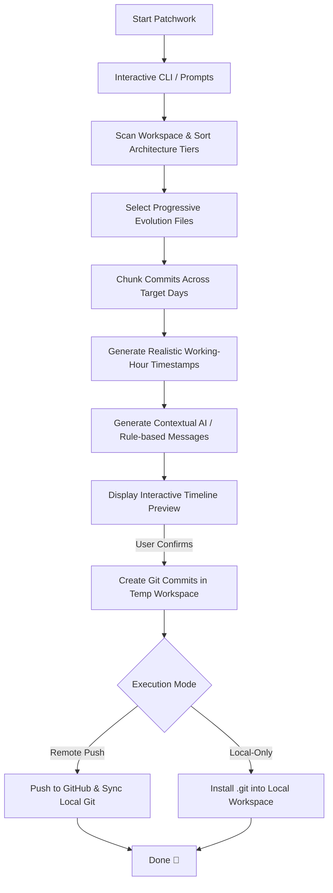

<div align="center">

```
  ██████╗  █████╗ ████████╗ ██████╗██╗  ██╗██╗    ██╗ ██████╗ ██████╗ ██╗  ██╗
  ██╔══██╗██╔══██╗╚══██╔══╝██╔════╝██║  ██║██║    ██║██╔═══██╗██╔══██╗██║ ██╔╝
  ██████╔╝███████║   ██║   ██║     ███████║██║ █╗ ██║██║   ██║██████╔╝█████╔╝ 
  ██╔═══╝ ██╔══██║   ██║   ██║     ██╔══██║██║███╗██║██║   ██║██╔══██╗██╔═██╗ 
  ██║     ██║  ██║   ██║   ╚██████╗██║  ██║╚███╔███╔╝╚██████╔╝██║  ██║██║  ██╗
  ╚═╝     ╚═╝  ╚═╝   ╚═╝    ╚═════╝╚═╝  ╚═╝ ╚══╝╚══╝  ╚═════╝ ╚═╝  ╚═╝╚═╝  ╚═╝
```

### *Spread your code. Look human.*

A developer CLI tool that distributes project files across natural-looking, chronological Git commits with realistic timestamps, architectural dependency ordering, progressive code evolution, and AI-generated commit messages.

[](LICENSE)
[](https://nodejs.org)
[](https://github.com)

</div>

---

## 🌟 Key Features

* **🧬 Progressive File Evolution (Multi-Pass Commits):** Simulates how real engineers build code. Large files are introduced in logical passes (e.g. scaffolding & signatures on Day 1, full implementations and polish on Day 3).
* **🤖 Smart Commit Message Generation:** Powered by **OpenRouter AI** (with auto key rotation and rate-limit handling) or an extensive **offline fallback rule engine** using Conventional Commits (`feat:`, `fix:`, `refactor:`, `chore:`).
* **🔌 Local-Only Mode (`--local`):** Build the entire commit history right on your machine in an offline `.git` repository without requiring a GitHub PAT or remote URL.
* **🔍 Dry-Run Preview Mode (`--dry-run`):** Inspect an interactive ASCII timeline of dates, timestamps, commit messages, and progressive file passes before committing anything.
* **⏰ Human Development Timestamps:** Loosely clusters commits within customizable working hours (10:00 AM – 1:00 AM) with natural jitter and realistic intervals (5–90 mins).
* **🏗️ Architectural File Sorting:** Orders files logically (config $\rightarrow$ core utilities $\rightarrow$ services/APIs $\rightarrow$ UI components $\rightarrow$ tests/docs $\rightarrow$ lockfiles) so the history mirrors real project development.
* **🔄 Incremental Mode:** When run against an existing repository, automatically detects only new and modified files and appends commits seamlessly.
* **🛡️ Security & Privacy:** Masks PATs and credentials in all error messages and terminal output.

---

## 🔄 How It Works



---

## 📦 Installation

### Global Install (via npm)
```bash
npm install -g patchwork
```

### Local / Development Setup
```bash
git clone https://github.com/vishvjeettanwar1623/patchwork.git
cd patchwork
npm install
npm link
```

---

## 🚀 Quickstart

Run `patchwork` inside any project folder:

```bash
cd /path/to/your/project
patchwork
```

### Command Line Options

| Flag | Description |
| :--- | :--- |
| `--local`, `-l` | Run in **Local-Only Mode** (creates local `.git` without pushing to GitHub or needing a PAT). |
| `--dry-run`, `-d` | Run in **Preview Mode** to inspect the timeline tree without making any Git commits. |
| `--no-evolution` | Disable progressive file evolution and commit files in single passes. |

### Examples

```bash
# Preview what commits would look like without touching git
patchwork --dry-run

# Create commit history locally (offline)
patchwork --local

# Preview local commit generation
patchwork --local --dry-run
```

---

## ⚙️ Configuration (`.env`)

You can create a `.env` file in the root of Patchwork to preconfigure settings:

```env
# GitHub default credentials (optional)
GITHUB_USERNAME=your_username
GITHUB_EMAIL=your_email@example.com

# OpenRouter AI for dynamic commit messages (optional)
OPENROUTER_API_KEY=sk-or-v1-...
# Or multiple comma-separated keys for auto-rotation:
# OPENROUTER_API_KEYS=key1,key2,key3

# Custom model (default: nvidia/nemotron-3-ultra-550b-a55b:free)
OPENROUTER_MODEL=meta-llama/llama-3.3-70b-instruct:free

# Disable AI generation and use offline rule-based messages
DISABLE_AI=false
```

---

## 🖥️ Interactive Preview Example

```text
  🔍 Interactive Commit Timeline Preview
  ═════════════════════════════════════════════════════════════════════
  Mode: Remote Push (GitHub sync)
  ─────────────────────────────────────────────────────────────────────

  📅 Day 1 (2026-08-21) — 2 commit(s)
  ├── 10:45 AM Add project configuration and environment setup
  │     • package.json
  │     • .gitignore
  └── 02:18 PM Scaffold authentication service interface
        • src/services/auth.js [pass 1: scaffold]
        • src/utils/crypto.js [pass 1: scaffold]

  📅 Day 2 (2026-08-22) — 2 commit(s)
  ├── 11:30 AM Implement user controller and authentication routes
  │     • src/controllers/user.js
  │     • src/routes/auth.js
  └── 04:50 PM Complete authentication logic and crypto validation
        • src/services/auth.js [pass 2: complete]
        • src/utils/crypto.js [pass 2: complete]

  ═════════════════════════════════════════════════════════════════════
  ? Do you want to proceed and create these commits? (Y/n)
```

---

## 🧪 Testing

Run feature verification tests:

```bash
npm test
# or
node test_features.js
```

---

## 📄 License

This project is licensed under the [MIT License](LICENSE).
